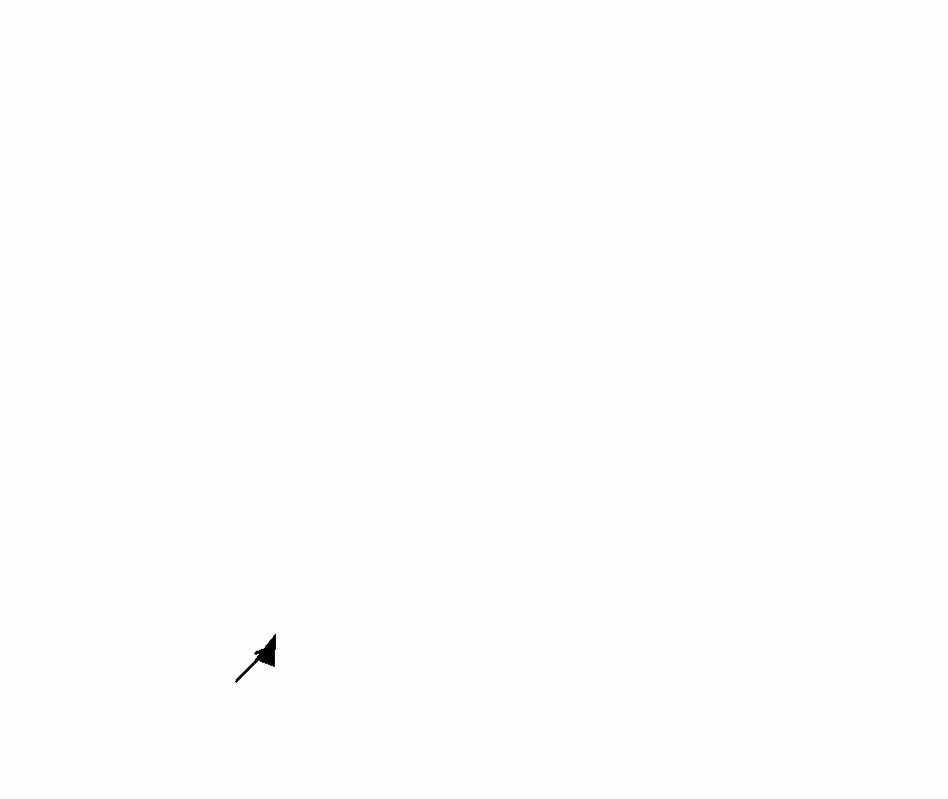

# Reeds-Shepp Curves

A Python implementation of Reeds-Shepp curves.




## Original paper:

```
Reeds, J. A.; Shepp, L. A. Optimal paths for a car that goes both forwards and backwards. Pacific J. Math. 145 (1990), no. 2, 367-393.
```

## Requirements

- Python 3.x


**NOTE:** `turtle` is a default package in Python. However, in Linux Operating Systems you may need to additionally install a backend for it (e.g. in Ubuntu):

```bash
sudo apt install python3-tk
```


## Usage

Run `demo.py` to see a simple example of Reeds-Shepp curve planning in a map.

To see the mainbody of the algorithm, figure it out in `reeds_shepp.py`. The formulas are implemented in pure Python.

The optimal total length used and the optimal path for every section is then printed in the console.

Example output:
```
Optimal path length: 53 px.
Optimal path:
0:  [{ Steering: left   Gear: forward   Length: 0.83}, { Steering: straight Gear: forward   Length: 5.83}, { Steering: left Gear: forward   Length: 0.44}]
1:  [{ Steering: left   Gear: forward   Length: 0.78}, { Steering: right    Gear: backward  Length: 1.57}, { Steering: straight Gear: backward  Length: 4.33}, { Steering: right    Gear: backward  Length: 0.78}]
2:  [{ Steering: left   Gear: forward   Length: 1.22}, { Steering: straight Gear: forward   Length: 1.9}, { Steering: right Gear: forward   Length: 1.57}, { Steering: left Gear: backward  Length: 0.21}]
3:  [{ Steering: left   Gear: forward   Length: 0.07}, { Steering: straight Gear: forward   Length: 6.38}, { Steering: left Gear: forward   Length: 0.57}]
4:  [{ Steering: left   Gear: forward   Length: 0.59}, { Steering: right    Gear: backward  Length: 1.57}, { Steering: straight Gear: backward  Length: 2.62}, { Steering: right    Gear: backward  Length: 0.75}]
5:  [{ Steering: left   Gear: backward  Length: 0.22}, { Steering: right    Gear: forward   Length: 1.57}, { Steering: straight Gear: forward   Length: 3.32}, { Steering: right    Gear: forward   Length: 0.82}]
6:  [{ Steering: left   Gear: backward  Length: 0.94}, { Steering: straight Gear: backward  Length: 9.31}, { Steering: right    Gear: backward  Length: 1.02}]
7:  [{ Steering: right  Gear: forward   Length: 0.01}, { Steering: straight Gear: forward   Length: 2.99}, { Steering: left Gear: forward   Length: 0.64}]
```


## Acknowledgement

[Reeds, J. A.; Shepp, L. A. Optimal paths for a car that goes both forwards and backwards. Pacific J. Math. 145 (1990), no. 2, 367-393.](http://dx.doi.org/10.2140/pjm.1990.145.367)

[nathanlct/reeds-shepp-curves](https://github.com/nathanlct/reeds-shepp-curves)

[benjaminbecker/reeds-shepp-curves](https://github.com/benjaminbecker/reeds-shepp-curves)

[OMPL/ReedsSheppStateSpace.cpp](https://ompl.kavrakilab.org/ReedsSheppStateSpace_8cpp_source.html)

For further reading, a discussion in [this issue](https://github.com/nathanlct/reeds-shepp-curves/issues/2) also helps.
